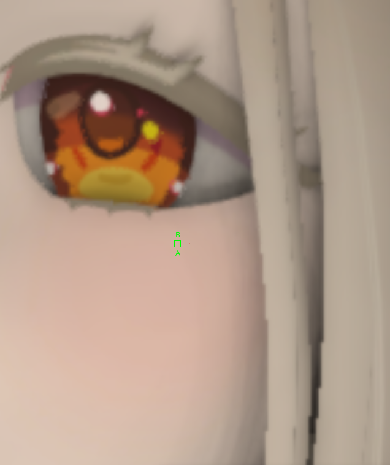

# DaVinci Resolve Fusion Node Pack

This adds a bunch of Fusion nodes.

## Installation

### Zip
1. Click `<> Code` and `Download zip`
2. Drag and drop the folder in the zip into your `DaVinci Resolve/Support/Fusion/Fuses`

### `git clone`
1. Open a command shell
2. `cd` (or equivalent) to `DaVinci Resolve/Support/Fusion/Fuses`
3. Perform `git clone` using the git url provided by Github in `<> Code`

## MLAA.Fuse 

||
|:------------------------------:|
| Top: MLAA on; bottom: MLAA off |

This applies morphological anti-aliasing on the GPU (as seen [here](https://github.com/GPUOpen-LibrariesAndSDKs/MLAA11/blob/master/mlaa11/src/Shaders/MLAA11.hlsl). This node actually translates this [shader toy](https://www.shadertoy.com/view/cllXRB), which is relatively simpler)
