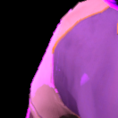

# DaVinci Resolve Fusion Node Pack <!-- omit from toc -->

This adds a bunch of DCTL nodes, mostly translations of some shader algorithms.

## Installation <!-- omit from toc -->

### Zip <!-- omit from toc -->
1. Click `<> Code` and `Download zip`
2. Drag and drop the folder in the zip into your `DaVinci Resolve/Support/Fusion/Fuses`

### `git clone` <!-- omit from toc -->
1. Open a command shell
2. `cd` (or equivalent) to `DaVinci Resolve/Support/Fusion/Fuses`
3. Perform `git clone` using the git url provided by Github in `<> Code`

## Contribution <!-- omit from toc -->

I consider myself a beginner in programming DCTL kernels. Because of some limitations with the kernel language versus HLSL/GLSL, I had to make multiple, complicated workarounds. Nonetheless, I am open to any proposed optimizations or readability improvements to the fuse's code.

## Table of Contents <!-- omit from toc -->
- [MLAA.Fuse](#mlaafuse)
- [SMAA.Fuse (Windows only)](#smaafuse-windows-only)
- [Appendix](#appendix)
  - [Anti-aliasing Comparison](#anti-aliasing-comparison)

## MLAA.Fuse 

|MLAA Demo|
|:------------------------------:|
||
| More layers of MLAA blurs the entire result, but it reduces aliasing on rimlighting on the head |

This applies morphological anti-aliasing (as seen [here](https://github.com/GPUOpen-LibrariesAndSDKs/MLAA11/blob/master/mlaa11/src/Shaders/MLAA11.hlsl). This node actually translates this [GLSL shader toy](https://www.shadertoy.com/view/cllXRB), which is relatively simpler)

Click [here](#anti-aliasing-comparison) to see a comparison of anti-aliasing nodes

## SMAA.Fuse (Windows only)

|SMAA Demo|
|:------------------------------:|
||
| More layers of SMAA reduces the aliasing more. THe shoulder appears more jagged, however |

> [!WARNING] 
> This fuse is confirmed to work for Windows. However, it is unlikely to work on Mac or Linux due to an issue with storing the area look-up texture in the `__CONSTANT__` address space.

This applies [submorphological anti-aliasing (SMAA)](https://www.iryoku.com/smaa/). This node translate this [HLSL shader](https://github.com/iryoku/smaa/blob/master/SMAA.hlsl).

Click [here](#anti-aliasing-comparison) to see a comparison of anti-aliasing nodes

### Setup <!-- omit from toc -->

The SMAA node relies on an Area and Search node to inform its algorithm. You can make a macro that groups these three nodes together while exposing significant parameters.

## Appendix

### Anti-aliasing Comparison

> [!NOTE] 
> These double on anti-aliasing nodes to make it more noticeable.

|Image||||
|:-:|:------------------------------:|:------------------------------:|:------------------------------:|
| **Description** | None | SMAA | MLAA |

|Image||||
|:-:|:------------------------------:|:------------------------------:|:------------------------------:|
|**Description**| None | SMAA | MLAA |

| No AA vs SMAA vs MLAA |
|:-:|
||
| Both nodes significantly reduces aliasing. |